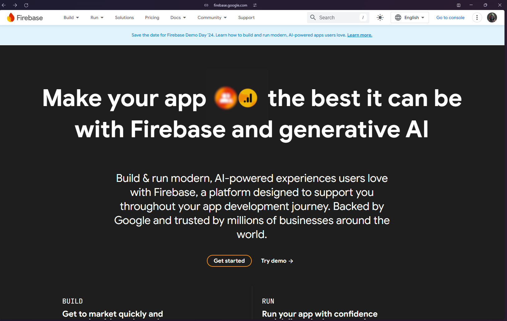

# Custom Chatbot (Junglee Parliament) - Prathamesh Prabhakar

## Overview

This is a custom chatbot application built with **React + Python** featuring a unique UI with Preset Prompts, Formatted responses with **Bullet Points** and **Bold Styling**.

## Samagri

* React + Vite ✡️
* Tailwind CSS 🎨
* Boxicons
* Python + Flask
* Common Sense
* ChatGPT (Bhagwaan) 
* Brains (Not the Brain Rotted Skibidi ones) 🧠
## Libraries

* **Flask** : For the backend
* **Firebase** : For the database
* **Google-Generativeai** : For using Gemini API
* **dotenv** : Loading API keys from .env file
* **os** : File Management
## Environment Variables

To run this project, you will need to add the following environment variables to your **.env** file to be placed in the **server** directory

`FIREBASE_DATABASE_URL`

`GOOGLE_API_KEY`

## How to Set Up Firebase

1. Go to **firebase.google.com**
   

2. Select

